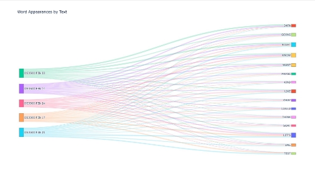
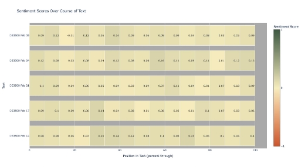
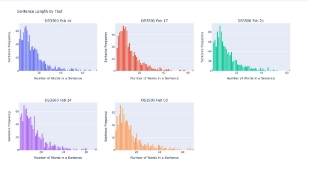
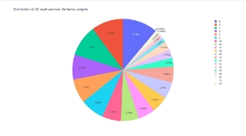

Kate Lanman, Sarah Bernardo, Kalden Harp, Lon Pierson Professor John Rachlin

DS 3500: Advanced Programming with Data

27 February 2023

Wordie: A Reusable Natural Language Processing Framework

**Background**

For this task, we created a reusable NLP library which has the capabilities to parse, filter, count, and separate our data into sentences, as well as create 4 visualizations based on the data (Sankey diagram, horizontal bar chart, bar chart subplots, pie chart). To demonstrate the capabilities of this library, we will look at five February lectures from Professor Rachlin’s DS3500 class this semester. To do this, we copied the transcripts of the meetings that are provided by Zoom. Based on the library’s visualizations, we set out to answer three primary questions:

1. What is the most common vocabulary used by Professor Rachlin during his lectures?
1. What is the average sentiment score of his lectures, and do they change over the period of the class?
1. What is the average sentence length that Professor Rachlin uses?

In order to accomplish these questions, we decided to use a Sankey graph, a horizontal bar chart, and a subplot of bar graphs, respectively.

**Author Contributions**

To complete this project, we all met to brainstorm, discuss, and actually implement each method. Because of this, we each had a hand in the ideas that led to the final product as well as the approaches we took to solve every problem we faced. The specific sections of the project each contributor was responsible for are outlined below:

1. Kate Lanman: ZoomTranscript class, get\_score, filter\_wordcount, load\_stop\_words, \_default\_parser, wordcount\_sankey, sent\_over\_time styling
1. Sarah Bernardo: pie\_chart, subplot\_bar, WordieError exception class, del\_stopwords
1. Kalden Harp: wordcount\_sankey, sent\_over\_time, WordieError exception class
1. Lon Pierson: pie\_chart, subplot\_bar, sen\_len, \_default\_parser, data collection.

**Methods**

The Wordie project is primarily held under one class (Wordie). Objects belonging to this class are collections of texts with the attribute data which has the general structure {statistic\_type: text\_label: result}. The library uses a default pre-processor to gather these results each time a new text is loaded, but the user does have the option of uploading their own parser. The default parser handle reading in a generic text file, lowercasing, and removing punctuation. The parser also stores the cleaned, plain text version of the file (str),  word counts (Counter), number of words (int), sentiment (dict), and sentence lengths (list).

**Fig 1.** Wordcount Sankey Diagram

Our first visualization is a Sankey diagram. The wordcount\_sankey() function mapped each document as a node on the left to word nodes on the right, using the thickness of the links to indicate how many times a word appeared in each text. Our function accepts the optional parameters of word\_list, allowing a user to input a list of particular words they would like to see as nodes, and a *k* value such that the Sankey diagram will feature the top *k* words across all texts. The default *k* value is 5. When we ran this function on the five DS3500 transcripts where *k*=15, it produced the graph shown above. This particular Sankey diagram displays the top 15 words said by Professor Rachlin through these classes. The majority of these words are verbs. It’s particularly interesting to note that the two nouns on this list are “data” and “test” (though “test” may also be used as a verb sometimes), which are two words that are extremely linked to data science.

**Fig 2.** Sentiment Scores Horizontal Bar Chart.

Our second visualization is a horizontal bar chart in which we overlaid one horizontal bar per document. The sent\_over\_time() function uses the Natural Language Tool Kit Library (NLTK) in conjunction with the Valence Aware Dictionary and Sentiment Reasoner (VADER) Sentiment Analysis package to display how the texts’ sentiments change over their duration by providing a sentiment score for *n* equal successive blocks. The user can specify *n* or use the default *n* value of 10. Our code produced the graph shown above when we ran it on the class transcripts. From this visualization, we can learn that Professor Rachlin’s speech is largely neutral throughout the class, though it leans positive almost all of the time.

**Fig 3.** Sentence Length Frequencies.

 

Our third and fourth visualizations are focused on the sentence lengths in the transcripts and looked to see which sentence lengths were most common. When looking at just one file a pie chart works nicely to see the distribution but for comparing multiple documents we created a subplots bar chart function for comparison. You can see that most sentences are pretty short with the most frequent lengths being around 3-5 words long. One thing to note here is that since the transcripts are auto generated by Zoom the results say less about Prof. Rachlins speaking and more about Zoom’s transcription tool.

One of the difficulties that we had to overcome in this project was the difference in the way that people speak vs write. We noticed that often in the transcripts that pauses as Professor Rachlin was thinking or typing in between were considered as different sentences. As a result, our findings in the 3rd visualization could be slightly inaccurate.

**Conclusion**

Overall, we aimed to make our library as universal as possible. The goal is that this library can be used on a wide range of text files and still yield interesting results. Over time, this library can be expanded to include further analyses and visualizations. Specific to our analysis, we are curious to see how transcripts from classes taught by Professor Rachlin compare to those taught by other teachers. In a broader scope, we would be interested to compare our results from this project to the visualizations produced when our same library is used on documents of various levels of formality, from transcriptions of impromptu influencer livestreams to movie scripts that have been revised countless times.

Our code and the relevant datafiles can be found [here](https://github.com/katelanman/comparative-text-analysis).
